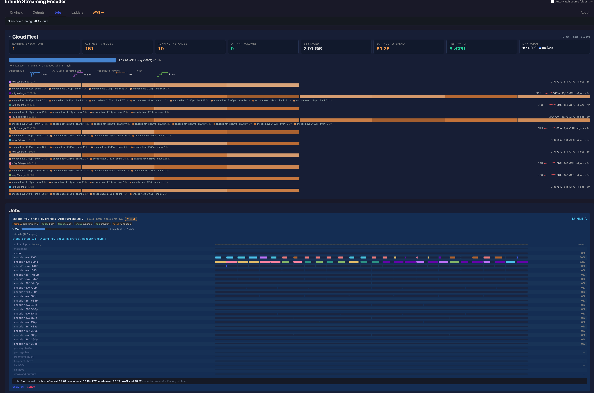

# infinite-streaming-encoder

[](https://github.com/jonathaneoliver/infinite-streaming-encoder/actions/workflows/ci.yml)
[](https://github.com/jonathaneoliver/infinite-streaming-encoder/releases/latest)
[](LICENSE)
[](https://github.com/jonathaneoliver/infinite-streaming-encoder/pkgs/container/infinite-streaming-encoder)
[](https://github.com/jonathaneoliver/infinite-streaming-encoder/stargazers)
[](https://github.com/sponsors/jonathaneoliver)



<p align="center"><em>One HEVC/H.264 cloud encode fanned out over 10 spot instances (96/96 vCPU busy, 151 Batch jobs, $1.38/hr) — live chunk grid, cost tracking, and a per-variant progress DAG with an ETA and a MediaConvert/on-demand/spot cost comparison.</em></p>

A **parallel, chunking video encoder**: it splits each source into chunks and
fans the encode out — many chunks at once — across either **AWS Batch spot
instances** or a **local farm of your own computers**. Same pipeline both ways;
you pick cloud or farm per job.

A thin Go HTTP **control plane** + single-page UI drives it all — planning the
adaptive-bitrate (ABR) ladder, chunking each variant, and streaming live
progress. The actual encoding — ffmpeg, Shaka Packager, LL-HLS/DASH packaging —
lives in a Python package that runs on the workers, cloud or LAN alike.

One Docker image plays three roles: the **server** (Go control plane, default
`CMD`), the **worker** (Python pipeline, via entrypoint override), and the
**UI** (`static/`, baked in and served by the server).

> **Not** a production encoding service or media origin. It's a hobbyist tool for
> generating test-ready ABR content and experimenting with encode ladders,
> packaging, and spot-resumable fan-out — tuned for reproducibility on a home lab,
> not for scale or an SLA. See [Project scope & roadmap](#project-scope--roadmap).

## Contents

- [Why you might want this](#why-you-might-want-this)
- [Prior art](#prior-art)
- [Two run modes](#two-run-modes)
- [What it does](#what-it-does)
- [How it works](#how-it-works)
- [Performance: single machine vs local farm vs cloud](#performance-single-machine-vs-local-farm-vs-cloud)
- [Quality & VMAF](#quality--vmaf)
- [Requirements](#requirements)
- [Quickstart](#quickstart)
- [Developing across the farm](#developing-across-the-farm)
  - [From edit to release](#from-edit-to-release)
- [Configuration](#configuration)
- [Programmatic use (HTTP API)](#programmatic-use-http-api)
- [Images & registries](#images--registries)
- [Repository layout](#repository-layout)
- [Documentation](#documentation)
- [Known limitations](#known-limitations)
- [Project scope & roadmap](#project-scope--roadmap)
- [Contributing](#contributing)
- [Acknowledgements](#acknowledgements)
- [License](#license)

## Why you might want this

Producing a full ABR ladder (multiple codecs × resolutions, LL-HLS **and** DASH,
with burned-in QA overlays) for testing is fiddly, and doing it *fast* usually
means renting big cloud boxes. Hand-rolled scripts, managed services, and generic
render-farm schedulers each solve part of that and leave the rest to you — see
[Prior art](#prior-art) for the honest comparison.

**What makes this different:**

- **Chunked and spot-resumable.** Every variant is split into chunks and fanned
  out; a lost worker or a reclaimed spot instance costs *one chunk*, not the whole
  encode. Interrupted jobs reattach and resume, not restart.
- **Local *or* cloud from one image.** The same Docker image encodes across your
  LAN (Temporal + MinIO, zero AWS) or across AWS Batch spot Graviton — pick the
  target per job. `$0` at rest between cloud runs.
- **You own the ladder.** A 6-tier bitrate table × 3 codecs, exact
  fps-derived GOP math, per-codec Apple-style ladder, and per-frame burned-in
  overlays (timecode, codec/res/fps, watermark, padding markers) — all in a
  readable, stdlib-first Python package you can edit.
- **Live, per-chunk observability.** The UI streams each phase and chunk as it
  runs, coloured by the machine that encoded it, so a multi-box farm is visible at
  a glance.
- **Both delivery formats, one run.** LL-HLS (fMP4 + `EXT-X-PART`) and DASH come
  out of the same encode, so cross-protocol player testing is apples-to-apples.

Pairs naturally with a player-testing setup — the output is exactly the kind of
deterministic ABR content a tool like
[infinite-streaming](https://github.com/jonathaneoliver/infinite-streaming) serves.

## Prior art

Almost none of the ideas here are new. Chunked parallel encoding, per-title
ladders, and quality-targeted rate control are all well-trodden — Netflix has
published on per-shot encoding and dynamic optimization for years. What follows
is the landscape as of writing, including where each alternative is genuinely
better than this project.

### Chunked parallel encoders

**[Av1an](https://github.com/rust-av/Av1an)** — the closest single analogue. A
command-line framework that splits a source into chunks, encodes them in
parallel across local processes, and concatenates the result. Originally
AV1-focused, now covers AV1/VP9/HEVC/H.264.

- **Better than this project at:** chunk boundaries. Av1an splits on *scene
  changes* (via PySceneDetect or a libaom first pass), so a chunk rarely
  straddles a cut and per-chunk rate control has a coherent scene to work with.
  This project splits on fixed frame counts, which is simpler and keeps GOP math
  exact, but means a chunk can span a hard cut. It's also a mature, widely used
  tool with a real community.
- **Doesn't cover:** packaging. Av1an produces an encoded file, not an ABR ladder
  — no HLS/DASH manifests, no multi-rung ladder, no LL-HLS parts. It also
  parallelizes across *cores on one machine*, not across machines, and has no
  durable resume: a crash mid-run loses in-flight chunks.

### Distributed library transcoders

**[Tdarr](https://github.com/HaveAGitGat/Tdarr)**,
**[Unmanic](https://docs.unmanic.app/)**,
**[FileFlows](https://fileflows.com/)** — server-plus-node systems that watch a
media library and fan transcodes out across machines. Structurally the closest
thing to this project's local farm: a coordinator, workers you add by installing
an agent and pointing it at the master, a queue, and a live worker dashboard.

- **Better than this project at:** almost everything around the encode. Mature
  web UIs, library scanning and watch folders, health-checks, plugin/flow editors
  for expressing "if HEVC and >1080p then…" as a pipeline, GPU worker classes,
  scheduling windows so encodes only run overnight, and communities orders of
  magnitude larger. FileFlows' flow designer and Tdarr's plugin stack are far
  beyond the fixed pipeline here.
- **Different job, not a worse one:** their unit of work is a **whole file**, and
  for their workload that's the right granularity — when you're normalizing 4,000
  library files, per-file distribution saturates every node with no split/join
  overhead, and chunking would be pure cost. It only becomes a limit in the case
  this project targets: a *single* long 4K/HEVC source, where whole-file
  granularity means one machine does the work and the rest of the farm idles. Here
  the unit is one (codec, rung, chunk), so a single file saturates the farm.
- **Doesn't cover:** ABR ladders or delivery packaging. These produce a
  transcoded *file*, not a multi-rung ladder with LL-HLS and DASH manifests, so
  nothing downstream of the encode overlaps. They also assume every node can
  reach the media over a shared filesystem (SMB/NFS), or push the file over the
  API; this project stages through an S3-compatible object store, so a worker box
  needs no mounts — only outbound reach to the master.
- **Failure granularity:** none of them document mid-file resume, so a node lost
  at 90% re-runs the file from the start. A lost worker here costs one chunk,
  because the workflow's event history knows exactly which chunks landed.

**[PeerTube remote runners](https://docs.joinpeertube.org/admin/remote-runners)**
— the closest of the four, and the only one in this section that produces an HLS
ABR ladder. An instance offloads CPU-heavy work to runners that register with a
token and pull jobs; job types cover VOD, live, studio edits, transcription and
storyboards, and the job model has real dependencies ("waiting for parent job").

- **Better than this project at:** being part of a complete federated video
  platform — upload, moderation, federation, playback and transcoding in one
  system, with live transcoding this project doesn't attempt at all.
- **Where this project goes further:** granularity is per-*resolution*, so
  resolutions spread across runners but each rung is one whole-file job on one
  machine — the 4K rung still gates the job. Chunking splits that rung across the
  fleet too. This project also targets multiple codecs per run with DASH beside
  HLS, and burned-in QA overlays, none of which are PeerTube's concern.

### Packaging orchestrators

**[Shaka Streamer](https://github.com/shaka-project/shaka-streamer)** (Google) —
a config-file-driven wrapper around FFmpeg + Shaka Packager, covering VOD and
live.

- **Better than this project at:** being the reference implementation for the
  packager this project also shells out to. If your need is "turn this file into
  DASH/HLS from a YAML config," it's simpler, better documented, and better
  maintained than anything here.
- **Doesn't cover:** distributed or chunked encoding. It runs FFmpeg
  single-process on one box, so a long 4K/HEVC ladder takes as long as it takes,
  with no fan-out, no resume, and no per-chunk progress.

### Managed services

**AWS MediaConvert, Bitmovin, Mux** — turnkey, SLA-backed encoding APIs.

- **Better than this project at:** basically everything operational. Codec
  licensing, per-title optimization, DRM, global scale, and someone to call when
  it breaks. For production delivery these are the correct answer and this
  project is not competing with them.
- **Doesn't cover:** the specific need this was built for — total control of the
  exact ladder, GOP math, and burned-in QA overlays, with a `$0` fully-local mode
  for iterating on player-test content. You pay per minute, and the encode itself
  is a black box you can't step into when a player misbehaves on one rung.

### Generic schedulers

**[Nomad](https://www.nomadproject.io/), Kubernetes Jobs** — the obvious way to
fan work out across machines.

- **Better than this project at:** scheduling, honestly. Both do real
  resource-aware bin-packing across heterogeneous nodes. This project's
  scheduling is `ENCODE_SLOTS` per worker plus a longest-processing-time sort in
  the workflow, tuned by hand — a general scheduler wouldn't have needed the
  task-queue partition fix this project did, and would handle P-core/E-core slot
  sizing without manual pinning.
- **Doesn't cover:** the DAG. Both schedule *tasks*; neither remembers where a
  multi-phase pipeline got to. The encode is mezzanine → audio → fan out every
  (codec, rung, chunk) → package → byteranges → HLS per codec, and something has
  to durably track which phase completed and what to re-run after a crash. With
  Nomad or K8s you write that state machine yourself. Temporal's event history
  *is* that state machine, and it also carries the two things the UI depends on:
  activity heartbeats with a payload (live per-chunk %, per-machine CPU) and
  cancellation that rides the heartbeat response so a running FFmpeg can be
  killed mid-encode. The operational cost matters too — adding a box here is one
  container and two env vars, where a scheduler would be the largest moving part
  in a two-machine farm.

### Hand-rolled FFmpeg + packager scripts

Where most people start, and where this project started.

- **Better than this project at:** being 40 lines you fully understand.
- **Doesn't cover:** one output at a time on one machine, no resumability — a
  crash or a closed laptop lid halfway through a ladder means starting over — and
  no live progress beyond FFmpeg's own stderr.

## Two run modes

Every encode is split into chunks and fanned out. You choose where the workers run:

- **`local` — "Local (all machines)."** Chunks fan out across one or more
  machines on your LAN via **Temporal** (durable orchestration) + **MinIO**
  (shared chunk store). No AWS. A worker box only needs Docker and outbound
  reach to the master.
- **`cloud` — "Cloud (AWS Batch)."** Chunks fan out across **AWS Batch**
  spot Graviton instances, driven by Step Functions, staged in S3.

(The older single-box `local` and one-box EC2 `cloud` targets were retired.)

## What it does

- Watches a source directory and auto-submits new files.
- Encodes an ABR ladder (H.264 / HEVC / AV1) with burned-in overlays, packaged
  as LL-HLS (fMP4 + EXT-X-PART) and DASH.
- Chunks each variant so work is **parallel and resumable** — a lost worker or
  reclaimed spot instance costs one chunk, not the whole encode.
- Streams live per-phase, per-chunk progress to the UI, coloured by the machine
  that ran each chunk.
- Serves the output for in-browser HLS/DASH playback.

## How it works

The Go server is a **thin control plane** — it holds no encoding logic itself. It
shells out to `docker`, `ssh`, `aws`, and `python3`; there's no Docker, Temporal,
or AWS SDK compiled in. A job flows like this:

```
                 ┌────────────────────── one Docker image, three roles ──────────────────────┐
  browser  ─▶  Go server (control plane)  ─spawns▶  per-job orchestrator container (Python)
  UI / API      · watches SOURCE_DIR                    │
                · plans the ladder + chunks             ├─ local  ─▶ Temporal + MinIO ─▶ workers (LAN boxes)
                · streams live progress (SSE)           └─ cloud  ─▶ Step Functions ─▶ AWS Batch spot (S3)
                · promotes finished output ─▶ OUTPUT_DIR ─▶ /content (HLS/DASH playback)
```

- The server **watches** `SOURCE_DIR` and auto-submits new files (or you submit via
  the UI / API). It plans the ABR ladder and splits each variant into chunks.
- Each job runs in a **detached sibling container** (via the mounted
  `docker.sock`), so encodes survive a restart of the server's own container and
  reattach on startup.
- Chunks fan out either to **local** workers (Temporal orchestration + MinIO shared
  chunk store, all on your LAN) or to **AWS Batch** spot instances (Step Functions
  + S3). Same Python pipeline both ways.
- Finished output is promoted into `OUTPUT_DIR` and served at `/content` for
  in-browser HLS.js / DASH playback.

**Ports** (all host-published; the master box runs the cluster):

| Port | Service |
| --- | --- |
| `8080` | server + UI + JSON/SSE API |
| `7233` | Temporal (local farm orchestration) |
| `8233` | Temporal UI (watch the workflow / chunk DAG) |
| `9000` | MinIO (shared chunk store) |

For the full design — the output-dir naming contract, worker-container reattach,
codec-skip logic, cloud user-data — see [`CLAUDE.md`](CLAUDE.md) and [`docs/`](docs/).

## Performance: single machine vs local farm vs cloud

Speed comes from one lever — **how many chunks encode at once** — traded against
each target's **startup overhead**. The three modes sit at different points on that
curve:

| | **Single machine** | **Local farm** (multi-box) | **Cloud** (AWS Batch) |
| --- | --- | --- | --- |
| Parallel chunks | this box's slots (`physical-cores ÷ 2`, 2 threads each) | **sum** of every box's slots | scales out to your Batch max-vCPUs |
| Startup overhead | none | none (workers already up) | ~60–90 s spot boot + ECR pull per cold box (an [AMI](#images--registries) removes the pull) |
| Marginal cost | electricity | electricity | spot $/vCPU-hr while running; **$0 at rest** |
| Resumability | reattaches on restart | lost chunk reschedules to another box | reclaimed spot chunk retries |
| Best for | small / quick jobs on one machine | big jobs + idle LAN boxes, no cloud spend | huge jobs, or no local hardware — burst wide, then scale to zero |

**The model in one paragraph.** Each worker runs `physical-cores ÷ 2` chunks
concurrently (2 threads per chunk), so a 10-core box does ~5 at once. Adding boxes
adds their slots, so a local farm scales **roughly linearly — until you run out of
chunks**: a 20-second clip is only a chunk or two, so it can't fill a big farm and
won't speed up much (the coordination just adds latency). Big, long jobs are where
fan-out pays. Cloud trades a fixed cold-start tax (spot boot + image pull) for
near-unlimited width — worth it when encode time far exceeds that tax (large jobs),
not for a tiny clip where the boot dominates. AV1 is the slow codec on every target.

**Don't guess — the app measures it.** Every job card reports the actual
`local_wall_s` (wall time), `cpu_vcpu_h` (CPU-hours), and what the same encode
*would* cost on AWS spot / on-demand / MediaConvert / a commercial encoder. For a
cloud run, dig into where the time and CPU went:

```bash
make timing     EXEC=<execution-arn>   # per-phase where-did-the-time-go
make cpu-report EXEC=<execution-arn>   # per-tier CPU utilization vs reserved vCPU
```

## Quality & VMAF

Perceptual quality (VMAF) is a first-class signal here, in two complementary
forms — one **measured**, one **estimated**.

**Measured — the per-chunk audit.** Tick **Measure VMAF** and each rendition is
scored against the source with `libvmaf`, per chunk, on a shared CFR frame grid
(the mezzanine is relabelled to the source's exact frame rate, so cadence jitter
can't desync the comparison and crater the score). Per-chunk results fold into a
frame-weighted mean, a correctly-recombined harmonic mean, and a min-of-mins, and
surface per rendition in the job view. Don't pair it with the burn-in overlay —
drawtext counts as distortion and biases the score.

**Estimated — the quality curves.** The Ladders tab predicts each rung's VMAF at
*design time* by interpolating a **rate-quality curve** (the built-in curves ship
seeded on a 4K extreme-motion clip — see the reports linked below). This drives
the ladder-design verdicts (*redundant / saturated / wide-gap*) and the optional
**burn-in overlay**: a `VMAF~93` (interpolated) or `VMAF≥97` (rung above the
measured range) row in the diagnostic text. It needs no second pass — a lookup is
free — but it reflects the *curve's* content, not necessarily yours.

**Calibrating to your own content (or a new ladder).** The estimate is only as
good as its curves. To replace the seed curves with measurements of your content:

```bash
# 1. encode a representative clip with the ladder — burn-in OFF (it biases VMAF)
# 2. measure its ladder into the curve store:
make ladder-audit OUT=<output-dir> SRC=<source-file>   # or: make ladder-audit-all
# 3. reload the curves into the running server:
make restart
```

Afterwards the Ladders tab and the burn-in overlay show *your* content's measured
VMAF per rung. Curves are content-keyed, additive across audits, and change only
when you re-audit — a normal encode never touches them.

The built-in curves come from a full ladder audit whose self-contained reports
live under [`docs/vmaf-audit/`](docs/vmaf-audit/): rate-quality curves and
three-codec BD-rate comparisons, graded at both 1080p and 4K.

## Requirements

- Docker (with the daemon socket at `/var/run/docker.sock`).
- For `local`: nothing else — `make farm-up` brings up the whole master profile
  (Temporal + MinIO + server + a worker) from one `docker-compose.yml`.
- For `cloud`: an AWS account, an existing S3 bucket, and the Terraform
  stack under `infra/terraform` applied (`make cloud-up`).

The image bakes in ffmpeg, Shaka Packager, the Docker CLI, and the AWS CLI.

## Quickstart

```bash
cp .env.example .env      # set SOURCE_DIR / OUTPUT_DIR / TMP_DIR (see below)
make farm-up                 # pull + bring up the whole master stack, UI at :8080
```

`make farm-up` is one `docker compose --profile master up` — Temporal + Temporal-UI +
Postgres + MinIO + the server + one local worker. Open `http://localhost:8080`,
drop a file in `SOURCE_DIR`, and submit a job.

`make farm-up` pulls the published image from GHCR. To build from your **working
tree** instead, use `make farm-dev-up` (below). `make run` / `make run-remote` bring
up **just the server** (against an already-running cluster), which is what
`make restart` / `make deploy` use to bounce it after an image change.

### From a clean checkout → running: three scenarios

Everything reduces to three, chosen by *where the workers run* and *whose code*:

| Goal | Commands |
| --- | --- |
| **Local farm, your working-tree code** (the dev loop) | `make farm-dev-up` |
| **Local farm, the published image** (multi-box, identical everywhere) | `make publish` → `make farm-up` |
| **Cloud (AWS Batch)** | `make cloud-up` → submit a `cloud` job → `make cloud-clear` |

- **`farm-dev-up`** builds from your working tree and needs no GHCR push; for any
  `DIST_WORKERS` boxes it rsyncs/builds your code to them too.
- **`publish` → `farm-up`** publishes one multi-arch image to GHCR, then every box
  (master + `DIST_WORKERS`) pulls that identical image.
- **`cloud-up`** provisions the AWS stack and pushes the image (it runs
  `publish`, one build to ECR **and** GHCR in sync); **`cloud-clear`** zeroes idle cost between sessions.
  Nothing runs on AWS until you submit a `cloud`-target job.

The sections below break each scenario down; teardown is `make farm-down` (local)
and `make cloud-clear` / `make cloud-down` (cloud).

### A single-machine distributed encode (`local`)

`make farm-up` already gives you this on one box — cluster + server + one worker.
Prefer the pieces individually?

```bash
make dist-up              # just the cluster: Temporal + Temporal-UI + Postgres + MinIO
make dist-worker          # just this box's worker
make run                  # just the server + UI
```
Submit with target **Local (all machines)**; watch the Temporal UI at `:8233`.

### A multi-machine farm

`make farm-up` brings this box up as master (cluster + server + worker) in one
compose command, then deploys a worker to each `DIST_WORKERS` box over SSH (run
`make publish` first so GHCR has your code):

```bash
# .env: MASTER_IP=<this box's LAN IP>
#       DIST_WORKERS=box2=me@box2.local box3=me@box3.local
make farm-up
```

Each **extra box** is just the `worker` profile — no cluster, no source dirs, no
MinIO/Temporal locally; it only dials the master's LAN Temporal + MinIO:

```bash
MASTER_IP=<master LAN IP> \
TEMPORAL_ADDRESS=$MASTER_IP:7233 S3_ENDPOINT_URL=http://$MASTER_IP:9000 \
  docker compose --profile worker up -d
```

Tear the whole farm down with `make farm-down` — it stops the local master stack
**and** removes the `encode-worker` on each `DIST_WORKERS` box over SSH (the true
inverse of `make farm-up`; `make down`/`dist-down` only stop the local stack). Add
`ARGS=-v` to also wipe the local Temporal/MinIO volumes.

See [`docs/PRD.md`](docs/PRD.md) and
[`infra/local-cluster/README.md`](infra/local-cluster/README.md).

### Cloud encoding (`cloud`)

```bash
make cloud-up          # new account / after an image change: provision + push + verify
                       #   (USE_AMI=1 also bakes the warm-start AMI)
```
Then submit with target **Cloud (AWS Batch)**.

## Developing across the farm

`make farm-dev-up` runs the **whole farm from your working tree — nothing committed
or pushed**:

- Builds the local image from your working-tree Go + deps (`up --build`).
- The `docker-compose.dev.yml` overlay bind-mounts your working-tree
  `scripts/infinite_streaming_encoder` into the server + worker (and, via
  `HOST_SCRIPTS_DIR`, the orchestrator containers the server spawns), so
  uncommitted **Python** runs everywhere without a rebuild.
- Remote boxes go through the arch-aware `deploy-worker.sh` (transfer to
  same-arch boxes, native build on cross-arch ones).

```bash
make farm-dev-up                 # edit code → re-run to propagate
make farm-dev-up DEV_BUILD=1     # also native-build uncommitted deps on cross-arch boxes
```

The inner loop is a `compose up --build` (fast, layer-cached) plus rsync-diffs to
remote boxes.

### From edit to release

Six stages. Each one narrows what can still be wrong, and `:latest` — what the
farm and remote workers pull — never moves until you deliberately release.

| | command | what it proves |
| --- | --- | --- |
| 1. Iterate | `make farm-dev-up` | your code runs. Python is bind-mounted, so nothing is published |
| 2. Test the image | `make farm-test-up` | the **image** runs. No mount, so packaging bugs surface |
| 3. Test on cloud | `make cloud-dev-up` | Batch runs it. Only if the change affects cloud |
| 4. Commit | `git commit` | the tested contents are now the committed contents |
| 5. Release | `make promote` | `:latest` and friends point at the image you tested |
| 6. Deploy cloud | `make infra-plan IMAGE_TAG=<tag> && make infra-apply` | Batch job definitions re-pin |
| 7. Re-bake AMI | `make ami-up && make infra-apply` | spot boxes cold-start fast again (optional) |

**Why stage 2 exists.** `farm-dev-up` bind-mounts your working-tree
`scripts/infinite_streaming_encoder` over the image's copy. That is what makes
iteration fast, and it also means the mount hides packaging bugs — a file
missing from the Dockerfile's `COPY` set, or a `requirements.txt` dep that only
exists on your machine. `farm-test-up` publishes the working tree under a
throwaway `dev-<branch>-<sha>` tag and runs the farm on that **published image
with no mount**, so those fail where you can see them.

Tags carry their own provenance. The sha names the last *commit*, but these
lanes build the *working tree*, so an uncommitted tree gets a `-dirty` suffix —
`dev-feat-x-a1b2c3d-dirty`. `farm-test-up` also publishes a moving
`dev-<branch>-test` alias so another box can pull your latest test build
without being handed a sha, while the farm itself runs the immutable tag so the
run stays reproducible. The alias is GHCR-only on purpose: a moving tag in ECR
would let an already-registered Batch job definition change what it runs with
no `infra-apply`.

**Why stage 5 is not `make publish`.** `publish` rebuilds. Same source, but a
new image — different base layers, freshly resolved deps — so it ships bits that
were never tested. `promote` **re-tags** the image you actually validated and
verifies every resulting tag is byte-identical to it:

```bash
make promote                     # FROM defaults to whatever was last published
make promote FROM=<tag>          # or name it explicitly
```

It applies the same tag sets `publish` does — GHCR gets `:latest`, `:<version>`,
`:<sha>`, `:<image-tag>`; ECR gets `:latest` and `:<image-tag>`, the tag
Terraform pins by. If the build never reached ECR (`farm-test-up` publishes GHCR
only) it **stops rather than half-promoting**, since moving `:latest` while
cloud stays pinned to something older is worse than doing nothing. Pass
`GHCR_ONLY=1` if that is genuinely what you want.

Stage 6 stays separate so publishing and deploying are two acts: Batch keeps
running its pinned tag until you apply. It is only needed when the change
touched what the image contains — `IMAGE_TAG` is derived from `Dockerfile`,
`requirements.txt`, `scripts` and `static`, so a Go-only change never re-pins.

**Why stage 7 is not optional if you use the AMI.** `make ami-up` bakes a worker
AMI with the image pre-pulled, so spot instances skip a ~60s ECR pull on cold
start. The AMI is tagged with the `image_tag` it was baked for, and `WORKER_AMI`
looks one up by the *current* tag — so the moment you promote a new image, the
baked AMI stops matching and cloud silently falls back to pull-on-boot. Nothing
breaks; encodes just get slower with no warning. Re-bake and re-apply to wire
the new one in, or `make ami-down` to clear it and accept pull-on-boot
deliberately. `make cloud-up USE_AMI=1` does the bake, wait and second apply in
one go.

Rolling back is the same mechanism: `make cloud-dev-down` restores the tag cloud
ran before, and `make promote FROM=<older-tag>` moves `:latest` back.

While iterating in stage 1, the About tab flags that it is serving mounted
working-tree code — the version, commit and image tag it shows describe the base
image, not the Python actually running.

## Configuration

`.env` at the repo root is auto-loaded by the Makefile. Only the host paths are
required; everything else has a working default. See
[`.env.example`](.env.example). Key groups:

- **Host paths (required):** `SOURCE_DIR`, `OUTPUT_DIR`, `TMP_DIR`.
- **Server:** `AUTO_WATCH`, `DEFAULT_TARGET` (`local` | `cloud`),
  `DEFAULT_CODEC`, `DEFAULT_MAX_RES`, `MAX_CONCURRENT`.
- **Distributed-local:** `MASTER_IP`, `DIST_WORKERS`, `ENCODE_SLOTS`, plus
  Temporal/MinIO vars (defaults match `make farm-up`; master vs. worker box is a
  `docker compose` profile choice).
- **Cloud:** `AWS_REGION`, `S3_BUCKET`, `STATE_MACHINE_ARN`, `WARM_MIN_VCPUS`.
- **Image/registry:** `GHCR_PAT`, `DOCKER_IMAGE`.

## Programmatic use (HTTP API)

The UI is a thin client over a plain JSON API on `:8080` — everything you can do in
the browser you can script. Submit an encode:

```bash
curl -X POST http://localhost:8080/api/encode \
  -H 'Content-Type: application/json' \
  -d '{"files":["myclip.mp4"],"target":"local","codec":"h264","max_res":"1080p","chunk_duration":"12"}'
```

| Field | Values |
| --- | --- |
| `files` | one or more names under `SOURCE_DIR` |
| `target` | `local` (LAN farm) · `cloud` (AWS Batch) |
| `codec` | `h264` · `hevc` · `av1` · `both` · `all` |
| `max_res` | cap the ladder, e.g. `1080p`; omit / `""` = all rungs |
| `chunk_duration` | seconds per chunk; omit / `""` = whole variant |
| `force_reencode` | `true` to re-encode even if output already exists |

Then watch it run and fetch the result:

```bash
curl localhost:8080/api/jobs                       # list jobs + status
curl -N localhost:8080/api/jobs/stream             # live updates (SSE): full job list, then deltas
curl localhost:8080/api/jobs/<id>/logs             # per-job log
curl localhost:8080/api/outputs                    # finished output dirs
curl localhost:8080/api/outputs/<name>/playlists   # HLS/DASH playlist URLs under /content
```

Selected endpoints:

| Method + path | Purpose |
| --- | --- |
| `GET /api/sources` | list files in `SOURCE_DIR` |
| `POST /api/encode` | submit a job (body above) |
| `GET /api/jobs` · `GET /api/jobs/stream` | poll / live-stream (SSE) job state |
| `POST /api/jobs/{id}/cancel` · `/retry` · `/redo` | control a job |
| `GET /api/outputs` · `/{name}/playlists` · `/{name}/logs` | browse finished output |
| `GET /api/dist/workers` · `POST /api/dist/workers/{machine}` | list / toggle farm workers |
| `GET /api/aws/inventory` · `POST /api/aws/clear` | cloud cost inventory / sweep |

Static file servers: `/content/` (HLS/DASH output for playback), `/sources/`
(direct source playback), `/logs/` (raw job logs).

## Images & registries

One `Dockerfile`, published/used four ways:

| Built by | Where | For |
| --- | --- | --- |
| `make build` | local daemon (`infinite-streaming-encoder`) | server + local/same-arch workers |
| `make publish` | GHCR always + ECR when cloud is configured (multi-arch) | all workers — farm (GHCR) + AWS Batch (ECR) + version display |
| `make publish-tag TAG=` | one tag only, `:latest` untouched (`SKIP_ECR=1` for GHCR only) | testing a build without handing it to every consumer |
| `make promote` | re-tags an existing image, never rebuilds | releasing the build you tested ([From edit to release](#from-edit-to-release)) |
| `make ami-up` | AWS AMI | pre-pull the ECR image onto spot boxes |

## Repository layout

```
docker-compose.yml   the unified farm: master / worker profiles (cluster + server + worker)
docker-compose.dev.yml         working-tree code-mount overlay (make farm-dev-up)
docker-compose.promote-*.yml   optional promote overlays (local dir / ssh remote)
cmd/server/          Go entrypoint
internal/encode/     control plane: Job/Manager, targets, scheduling, promote
internal/api/        HTTP + SSE, dist worker toggle, static file servers
internal/watcher/    source-directory auto-submit
internal/awswatch/   cloud inventory watchdog + Batch keep-warm
scripts/infinite_streaming_encoder/     the Python encoder package
  cli_local_dist.py    distributed-local orchestrator (Temporal backend)
  temporal_worker.py   the per-box worker (activities + workflow DAG)
  cli_batch.py         AWS Batch: Step Functions submit/poll
  cli_local.py         the phase entry point Batch job-defs invoke
  cloud/               boto3 helpers (Batch admin, inventory, sync, …)
infra/local-cluster/ worker + SSH deploy scripts (the cluster compose moved to ./docker-compose.yml)
infra/terraform/     AWS Batch + Step Functions + ECR + IAM
static/index.html    the single-file SPA
docs/                design docs
```

## Documentation

- [`docs/PRD.md`](docs/PRD.md) — product requirements: problem, goals, scope.
- [`infra/local-cluster/README.md`](infra/local-cluster/README.md) — the distributed-local cluster.
- [`docs/chunked-encode-design.md`](docs/chunked-encode-design.md) — spot-resumable chunked encoding.
- [`docs/apple-ladder-design.md`](docs/apple-ladder-design.md) — per-codec ABR ladder model.
- [`docs/vmaf-audit/`](docs/vmaf-audit/) — VMAF ladder-audit reports (rate-quality curves + three-codec BD-rate, at 1080p and 4K).
- [`CLAUDE.md`](CLAUDE.md) — orientation for working in this repo.

## Known limitations

Deliberate non-goals and rough edges — worth knowing before you rely on it:

- **No hardware encoding.** VideoToolbox (`--force-hardware`) was dropped in the
  rewrite — it only worked on macOS hosts, not Linux workers. Everything is
  software (libx264 / libx265 / libaom-av1).
- **No automated test suite.** Correctness is a manual smoke matrix
  ([`docs/TESTING.md`](docs/TESTING.md)); the per-PR CI gate is `gofmt`/`vet`/build
  plus a cold-boot smoke encode.
- **Single control-plane server.** One server process per farm — not HA, no
  horizontal scaling of the control plane itself (the *workers* scale; the
  coordinator doesn't).
- **UI can't cold-provision workers.** The worker on/off toggle can only
  start/stop boxes already provisioned by `make farm-up` — it won't stand up a
  brand-new machine from the UI.
- **AV1 is slow.** `libaom-av1` software encoding is dramatically slower than
  H.264/HEVC; use it selectively.
- **LAN-trust security model.** The server mounts `docker.sock` (root-equivalent),
  `~/.aws`, and `~/.ssh`; run it only on a trusted network. See
  [`SECURITY.md`](SECURITY.md).

## Project scope & roadmap

This is a **side project**, built and run on a home lab (a Mac + a couple of spare
boxes). The UI isn't perf-tuned and the server isn't built for production scale —
it's tuned for reproducible encodes and experimentation, not throughput or uptime.

Rough direction, no dates and no commitments:

1. **Reproducible ABR output, local or cloud.** *Done.* One image, chunked
   spot-resumable fan-out across a LAN farm or AWS Batch, LL-HLS + DASH from the
   same run.
2. **Observability + cost control.** *Done.* Live per-chunk progress, per-job logs,
   cloud cost inventory + one-click sweep (`$0` at rest).
3. **Ladder ergonomics.** *In progress.* Editable per-codec ladders, VMAF-informed
   bitrate selection, saved presets.
4. **Deeper cloud parity + benchmarking.** *Future.* Systematic encode-time / cost
   / quality comparison across codecs, ladders, and local-vs-cloud targets.

## Contributing

Contributions are welcome — see [`CONTRIBUTING.md`](CONTRIBUTING.md) for the dev loop, the
smoke-test matrix (there's no unit suite), and PR conventions. By participating you agree to
the [Code of Conduct](CODE_OF_CONDUCT.md). To report a vulnerability, see
[`SECURITY.md`](SECURITY.md).

## Acknowledgements

This tool is a control plane — the heavy lifting is done by excellent open-source
projects it orchestrates:

- **[FFmpeg](https://ffmpeg.org/)** — probing, mezzanine stream-copy, and every
  variant encode (libx264 / libx265 / libsvtav1).
- **[Shaka Packager](https://github.com/shaka-project/shaka-packager)** (Google) —
  fMP4 packaging and DASH manifest generation.
- **[hls.js](https://github.com/video-dev/hls.js)** — in-browser LL-HLS playback in
  the dashboard.
- **[Temporal](https://temporal.io/)** — durable orchestration of the local farm's
  chunk fan-out (survives worker/box restarts).
- **[MinIO](https://min.io/)** — the LAN-local S3-compatible shared chunk store.
- **[AWS Batch](https://aws.amazon.com/batch/) + [Step Functions](https://aws.amazon.com/step-functions/)**
  — spot-instance fan-out and the cloud encode DAG.
- **[boto3](https://github.com/boto/boto3)** and the Go standard library — the only
  language-level dependencies of note.

Codecs and standards: **H.264/AVC**, **H.265/HEVC**, **AV1** (via
[SVT-AV1](https://gitlab.com/AOMediaCodec/SVT-AV1)), **HLS**/**LL-HLS**, and
**MPEG-DASH**.

## License

Licensed under the **InfiniteStream License** (attribution + internal use + no productization
without permission) — see [`LICENSE`](LICENSE). Redistributions must preserve attribution to
Jonathan Oliver (see [`NOTICE`](NOTICE)).

## Notes

- No test suite exists in this repo — there is no test command.
- Direct pushes to `main` are blocked by a git hook; use a PR (`make setup-hooks`).
